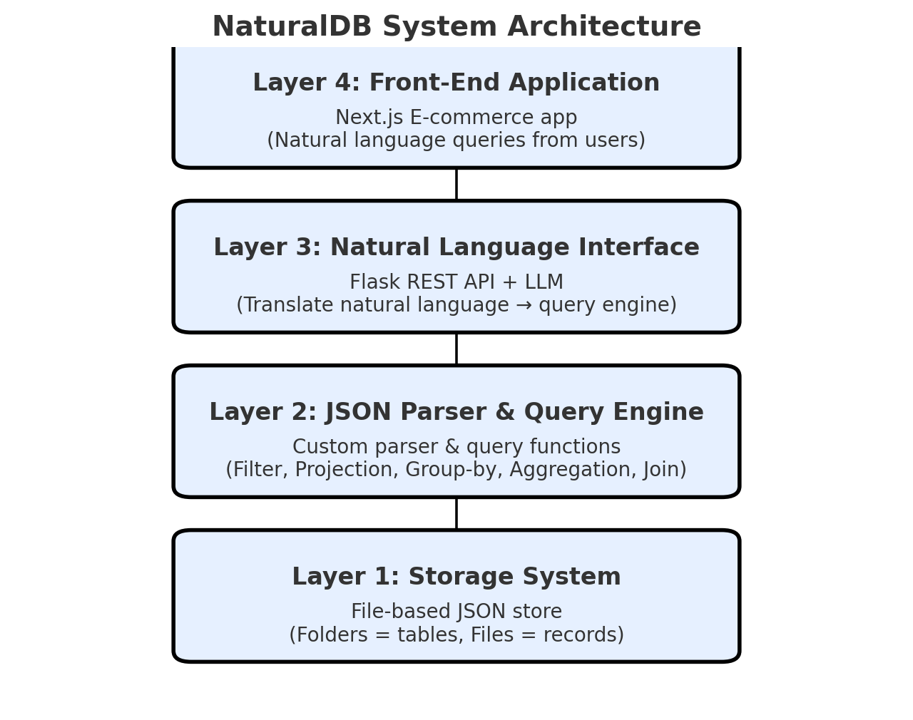

# NaturalDB 🚀  
*A Natural-Language-Driven NoSQL Database System (with E-commerce Demo)*  

🚧 This project is a work in progress and may not be fully functional. 🚧



## Overview  
**NaturalDB** is a custom **NoSQL database system** designed to store and query JSON data while supporting **natural language interaction**.  

Features include:  
- ✅ CRUD operations (Create, Read, Update, Delete)  
- ✅ Advanced queries: filtering, projection, group-by, aggregation, join  
- ✅ Lightweight JSON storage backend  
- ✅ Query engine for structured operations  
- ✅ LLM-powered natural language interface  
- ✅ Security layer for sensitive operations  

For demonstration, we use the [Amazon Sales Dataset](https://www.kaggle.com/datasets/karkavelrajaj/amazon-sales-dataset), preprocessed into JSON collections (e.g., `Products`, `Ratings`, `Customers`).  
We also provide a **Next.js e-commerce app** that allows users to browse products, view ratings, and manage orders using **natural language queries**.  

---

## Architecture 🏗️  

### Layer 1: Storage System  
- File-based key-value store.  
- Folders map to tables (e.g., `Products/` = Products collection).  
- Files map to records (e.g., `Products/1.json` = product with ID 1).  
- File-locking for minimal transaction safety.  

### Layer 2: JSON Parser & Query Engine  
- Custom JSON parser (no external `json` library).  
- Query engine supports filtering, projection, group-by, aggregation, join.  

### Layer 3: Natural Language Query Interface  
- LLM module converts natural language → query functions.
  - Example: `"Find orders with rating 5"` → `orders.filter(rating=5)`.
  - Built with **OpenAI Function Calling** for structured outputs.
  - Automatic tool registration from QueryEngine methods.
- Sensitive ops (`update`, `delete`) require confirmation/authorization.
- **Components:**
  - `function_calling.py` - Automatic tool registration system
  - `tool_registry.py` - Database operations to OpenAI tools mapper
  - `nl_query_processor.py` - Natural language to function calls
  - `executor.py` - Execute function calls on QueryEngine
  - `naturaldb.py` - Unified high-level API
- **Usage:**
  ```python
  from naturaldb.nlp_interface import NaturalDB
  from naturaldb.entities import User, Database
  
  db = NaturalDB(User("alice", "Alice"), Database("shop"))
  result = db.query("Show me all products with price > 100")
  ```
- Can be packaged as a reusable **Python library**.  
- See [NLP Interface Documentation](naturaldb/nlp_interface/README.md) for details.
- 

### Layer 4: Front-End Demo (E-commerce)  
- Built with **Next.js**.  
- Users can browse products, view ratings, manage orders.  
- All interactions go through **Flask APIs + NaturalDB**.  
- Demo use-case is e-commerce, but NaturalDB is **application-agnostic**.  

---

## Deployment ☁️  
- **Vercel** used for both backend and frontend deployment.  
- CI/CD pipeline for automated updates.  


---

## Getting Started 💻  

> 🚧 Work in Progress – instructions will be updated as features are built.  

### Prerequisites  
- Python 3.10+  
- Node.js 18+  
- Flask, Next.js, and (optionally) OpenAI/LLM API keys  

### Installation  
```bash
# Clone repo
git clone https://github.com/your-username/naturaldb.git
cd naturaldb

# Backend setup
cd backend
pip install -r requirements.txt
python app.py

# Frontend setup
cd ../frontend
npm install
npm run dev
